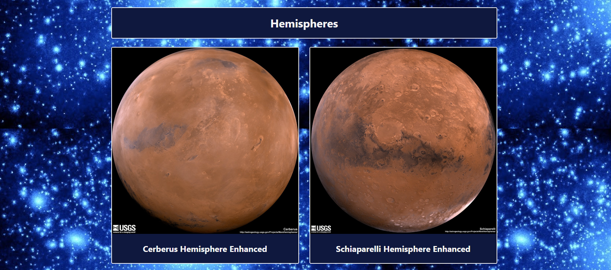

# Week 13 Web Scraping Challenge!
By A. Rijpkema on 1/22/2020

What a fun assignment this was. I could barely stop working on it and kept (read keep) on seeing things that could look better. For the homework assignment, please use the Mission_To_Mars folder (and not the Mission_To_Mars_II_HEROKU folder!!)

The index.html file only works actively, if it is started from Flask (by running app.py from a python shell). When clicking "Scrape new data", 5 websites will be scraped.It needs chromedriver.exe to function.
The returned information is stored in  a mongoDB database and in turn read by the index.html file to reflect the most current information.

Here are 4 screenshots of the output, since refreshing the index.html only works with an active: http://127.0.0.1:5000/ port running and the required files in place.
For my private website, I saved the .html output to a separate file, so that the it would be visible when clicked on. Refreshing however only works if the app.py etc. is running in place.

Start of the page and latest news articles:

 

Feature picture, latest weather and Mars facts:

 

4 Different Hemispheres:

 

 